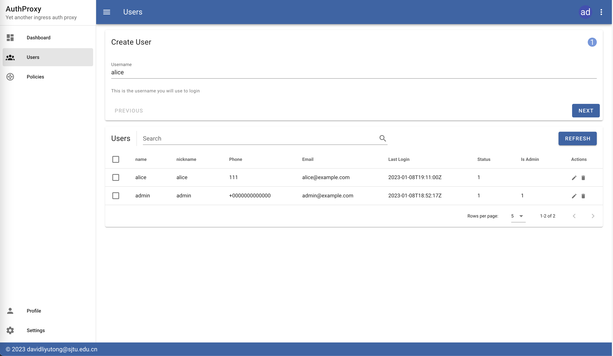

# Deployment

To get started, first clone this repository

```shell
git clone https://github.com/davidliyutong/ingress-authproxy
cd ingress-authproxy
```

You can run this application for demo purpose or for production purpose

## For demo purpose

For demo purpose, run this application with `docker-compose`. You can easily get `docker-compose` from the package manager of your distribution.

```shell
cd manifests/authproxy
docker-compose up
```

This will launch 3 containers: a mysql database, an auth backend and an auth frontend. You can access the frontend from [http://localhost:8080](http://localhost:8080). A default admin user will be created with password `admin123456`

After logged in, the admin panel should appear:


## Adjusting Access Policies

There is no user except admin by default, therefore the admin must add some users.

Create a demo user in Users panel, such as `alice:alice` under `Users` section



> The user Alice can change its password from [http://localhost:8080/passwordreset](http://localhost:8080/passwordreset)

Open `http://localhost:8080/v1/ingress-auth/test1`, the browser will ask for password input. Type the correct credentials of alice, the request should be rejected since no policy is enabled for Alice

> There is no access policy by default, therefore the admin must add some access policies.

Navigate to the policy panel, then create a policy that grants Alice access to test1


The server will now authorize Alice's access to /v1/ingress-auth/test1. This is an Resfull API that returns an json object according to K8S ingress specifications.

```json
{"authenticated":true,"user":"alice"}
```

> This will also set the `x-forwarded-user` header to username.

Add the a authorization policy to allow user `alice` to access this ingress:

```json
{
  "description": "Allow alice access",
  "subjects": ["users:alice"],
  "actions" : ["get"],
  "effect": "allow",
  "resources": [
    "resources:ingress-auth:test1"
  ]
}
```

Add the a authorization policy to reject user `bob`:

```json
{
  "description": "Deny bob access",
  "subjects": ["users:bob"],
  "actions" : ["get"],
  "effect": "deny",
  "resources": [
    "resources:ingress-auth:test1"
  ]
}
```

Add the a authorization policy to allow user `admin` to access all ingress resources:

```json
{
  "description": "Allow admin access",
  "subjects": ["users:admin"],
  "actions" : ["get"],
  "effect": "deny",
  "resources": [
    "resources:ingress-auth:<.*>"
  ]
}
```

## For production

For deployment in kubernetes clusters, use the `manifests/k8s/deployment.yaml`:

```yaml
kubectl apply -f manifests/k8s/deployment.yaml -n <namespace>
```

This will create the following resources in your cluster's namespace

- an `ingress-authproxy.<namespace>.svc.cluster.local` service with port `80`
- a PersistenceVolumeClaim with capacity of 1GiB using default StorageClass
- a Deployment of 3 containers in one Pod: mysql database, backend, frontend

You can modify the `manifests/k8s/deployment.yaml` to meet your need (e.g. using an external database)

To protect target K8S ingress resource, add this snippet to its annotations

```yaml
annotations:
  nginx.ingress.kubernetes.io/auth-response-headers: X-Forwarded-User
  nginx.ingress.kubernetes.io/auth-url: "http://ingress-authproxy.<namespace>.svc.cluster.local/ingress-auth/<resource>"
```

Hint: Replace `<namespace>` and `<resources>` with deployed namespace of ingress authproxy and the name of resource.

## Exposing admin panel as public ingress

**Warning:** in order to protect your password, the ingress resource must configure TLS certificate.

To expose authproxy as another ingress resource for external access and user password reset, create this ingress resource

```yaml
apiVersion: networking.k8s.io/v1
kind: Ingress
metadata:
  annotations:
    kubernetes.io/ingress.class: nginx # replace with your ingress class
  name: ingress-authproxy
spec:
  rules:
  - host: authproxy.example.com # replace with your hostname
    http:
      paths:
      - backend:
          service:
            name: ingress-authproxy # replace with your service name
            port:
              number: 80
        path: /
        pathType: Prefix
  tls:
  - hosts:
    - authproxy.example.com # replace with your hostname
    secretName: authproxy.example.com-certificates # replace with your certificate
```

Change the annotation if you like:

```yaml
annotations:
  nginx.ingress.kubernetes.io/auth-response-headers: X-Forwarded-User
  nginx.ingress.kubernetes.io/auth-url: "https://authproxy.example.com/ingress-auth/<resource>"
```

The user can reset their password at [https://authproxy.example.com/passwordreset](https://authproxy.example.com/passwordreset)


